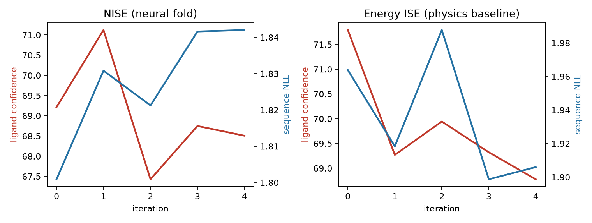
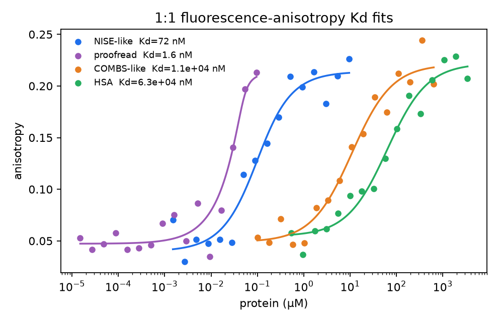
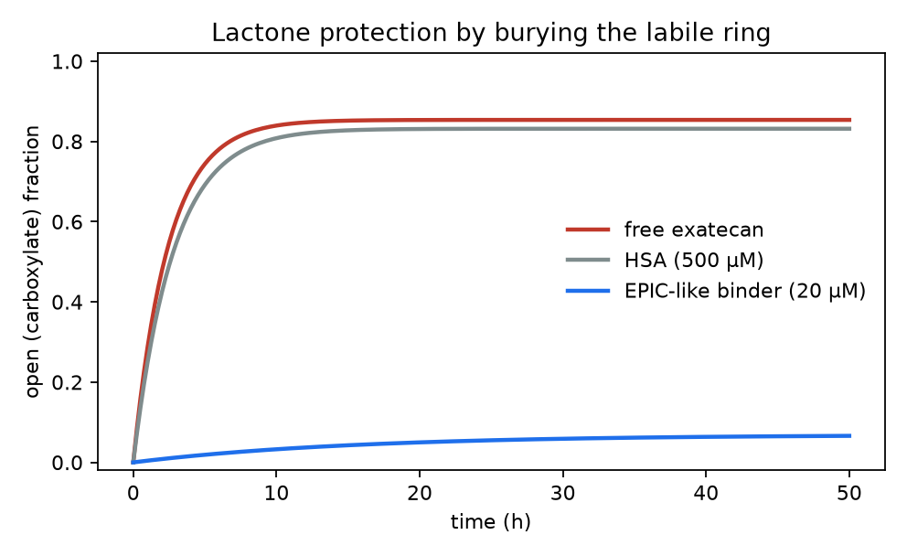

# NISE binder design

[](https://share.streamlit.io/deploy?repository=abdullahabdulsami2026-coder/nise-binder-design&branch=main&mainModule=streamlit_app.py)

A compact, runnable reimplementation of **neural iterative selection–expansion (NISE)** from:

> Fry, Slaw & Polizzi. *Zero-shot design of drug-binding proteins via neural iterative selection−expansion.* Nature **656**, 237–249 (2026). [doi:10.1038/s41586-026-10670-w](https://www.nature.com/articles/s41586-026-10670-w)

The paper showed that a closed loop between a ligand-aware sequence model and a protein–ligand co-structure predictor can design de novo binders (exatecan, apixaban) with very high experimental hit rates. This repo recreates that **recipe** so you can run it on a laptop, inspect every step, and reuse the analysis tools.

It is **not** a drop-in replacement for the authors’ trained LASErMPNN / Boltz-2 stack, and it does not redistribute their patented EPIC / APEX sequences. For production design use the official code:

- [polizzilab/LASErMPNN](https://github.com/polizzilab/LASErMPNN)
- [polizzilab/NISE](https://github.com/polizzilab/NISE)

## What NISE is

Binder design is a three-way problem: sequence, backbone, and ligand pose have to agree. NISE climbs the joint

\[
P(\text{sequence},\;\text{structure},\;\text{ligand})
\]

by alternating the two conditionals the networks actually know:

1. **Expansion** — sample many sequences from \(P(\text{seq}\mid\text{struct},\;\text{lig})\) (LASEr-lite).
2. **Co-structure prediction** — fold each sequence with the ligand, \(P(\text{struct},\;\text{lig}\mid\text{seq})\).
3. **Selection** — keep designs that are self-consistent (low backbone *and* ligand RMSD) and have high ligand confidence, and feed those poses back in.

That is the same loop as Fig. 1b of the paper. A physics-only control (sequence design + energy minimization, selected by ligand energy) is included because the paper showed it does **not** jointly improve sequence likelihood and ligand confidence.

```text
docked backbone + ligand
        │
        ▼
 ┌──────────────┐   sequences    ┌─────────────────┐
 │  LASEr-lite  │ ─────────────► │    Fold-lite    │
 │ P(seq|pose)  │                │ P(pose|seq,lig) │
 └──────────────┘                └────────┬────────┘
        ▲                                 │
        │   keep high ligand pLDDT        │
        │   + self-consistent poses       │
        └─────────────────────────────────┘
```

After a trajectory, **neural proofreading** scores \(P(A_i\mid A_{-i},\;\text{pose})\) at pocket residues and suggests substitutions that lower NLL — the step that improved EPIC by ~100× in the paper (Q51N / M97L).

## What’s in this repo

| Piece | Paper | Here |
|---|---|---|
| Ligand-aware sequence GNN | LASErMPNN (PDB + SPICE, all-atom) | LASEr-lite heterograph MPNN, CPU-trainable |
| Ligand encoder | Quantum partial charges (SPICE) | Element-wise charge proxy + MPNN |
| Co-structure predictor | RFAA or Boltz-2 | Fold-lite EGNN + ligand confidence head |
| Scaffolds | Hallucinated 4-helix bundles / NTF2 | Parametric 4-helix bundles with a central pocket |
| Ligands | Exatecan, apixaban | Pharmacophore-level `exatecan-like` and `apixaban-like` |
| Ranking | Buried unsatisfied polars | Same filter |
| Assays | Fluorescence anisotropy Kd; lactone hydrolysis | `nise-binder fit-kd` and `hydrolysis` |

One command trains the two networks on a **self-consistent synthetic world** (rule-based natives on helical bundles), runs NISE vs energy-ISE, proofreads the best sequence, and recreates the paper’s Kd / hydrolysis plots from the published numbers.

## Install

Python 3.10+ (3.13 is fine). CPU is enough.

```bash
python -m venv .venv
source .venv/bin/activate
pip install -e ".[dev,app]"
```

## Run the app

```bash
nise-binder app
```

This opens a Streamlit UI in the browser: pick a public PDB complex (default: EPIC `9NZE`), run NISE with bundled weights, inspect designs in 3D, proofread pocket residues, and fit Kd or hydrolysis CSVs.

## Share / deploy

The live app is meant to be shown to a colleague without installing anything. Bundled CPU weights skip training; Streamlit Cloud defaults use a lighter NISE loop so the free tier does not run out of RAM.

**Streamlit Community Cloud (recommended)**

1. Make this GitHub repo public (or grant Streamlit access).
2. Open [deploy this app](https://share.streamlit.io/deploy?repository=abdullahabdulsami2026-coder/nise-binder-design&branch=main&mainModule=streamlit_app.py), sign in with GitHub, and click Deploy.
3. Send the resulting `*.streamlit.app` URL.

If you already connected the repo in [share.streamlit.io](https://share.streamlit.io), set **Main file path** to `streamlit_app.py` and Python to 3.11.

**Docker**

```bash
docker build -t nise-binder .
docker run --rm -p 8501:8501 nise-binder
```

Then open http://localhost:8501. The same image can be hosted on Render, Fly.io, or any container host.

**CLI with bundled weights**

```bash
nise-binder demo --source public --pdb 9NZE --outdir results
```

Use `--no-pretrained` only if you want to retrain LASEr-lite / Fold-lite from scratch.

## Public PDB mode

The NISE loop can start from **real crystal structures** downloaded from the RCSB PDB (no toy ligand):

```bash
nise-binder demo --source public --pdb 9NZE --outdir results
```

Catalog used for training and as UI presets:

| PDB | Complex | Why it is here |
|---|---|---|
| 9NZE / 9NZG | EPIC ± Q51N + exatecan | Paper crystal structures |
| 6W70 | ABLE + apixaban | Polizzi & DeGrado 2020 |
| 8TN6 | PiB + rucaparib | COMBS binder held out in the paper |
| 4JNJ | Streptavidin monomer + biotin | Paper sequence-recovery test |
| 3PTB | Trypsin + benzamidine | Classic public complex |

In the app, choose **Public PDB (RCSB)**. Coordinates and crystal sequences are authentic. Redesigned sequences still come from LASEr-lite, not from the authors’ trained weights, and the Kd/hydrolysis panels still need *your* measurements (or the published fitted constants).

Official production models remain [LASErMPNN](https://github.com/polizzilab/LASErMPNN) and [NISE](https://github.com/polizzilab/NISE).

## Run the demo

```bash
nise-binder demo --outdir results
```

Useful flags: `--steps 60` (training), `--rounds 5`, `--n-expand 12`. Add more steps/rounds if you want a cleaner Fig. 1c-style trajectory.

Outputs in `results/`:

- `nise_vs_energy.png` — ligand confidence vs sequence NLL over iterations (NISE vs physics ISE)
- `design_*.pdb` / `designs.fasta` — selected binders (open in PyMOL / ChimeraX)
- `proofread.fasta` — top LASEr substitutions on the best design
- `kd_fits.png` — 1:1 isotherms at the published EPIC / COMBS / HSA Kds
- `hydrolysis.png` — why burying the lactone protects camptothecins
- `summary.json` — metrics for the run

On the synthetic demo, pocket chemistry (whether pocket residues match the ligand atom they contact) typically lands in the 80–100% range after a few NISE rounds. Exact recovery of one “native” sequence is lower on purpose: many amino acids are valid at each site, just as in real design.







## Fit your own measurements

Fluorescence-anisotropy titration (quadratic 1:1 model, residual bootstrap CI):

```bash
nise-binder fit-kd examples/epic_fp.csv --ligand 5e-8
```

Lactone closed ⇌ open kinetics:

```bash
nise-binder hydrolysis examples/hydrolysis_free.csv
```

CSV headers are `protein_M,anisotropy` and `hours,open_fraction`.

## Library usage

```python
from nise_binder.dataset import make_complex
from nise_binder.nise import NISEConfig, nise, proofread
from nise_binder.train import train_pair

laser, fold, poses = train_pair(n_data=24, laser_steps=60, fold_steps=60)
start = poses[0].copy()
start.sequence = None  # keep backbone + ligand only, as in the paper

result = nise(laser, fold, start, NISEConfig(rounds=5, n_expand=12))
best = result.designs[0]
print(best.sequence, best.scores.ligand_plddt, best.scores.nll)

for mut in proofread(laser, best.pose, best.sequence)[:4]:
    print(mut.from_aa, mut.position + 1, mut.to_aa, mut.delta_nll)
```

## How this maps onto the paper

1. **Self-consistency includes the ligand.** Backbone RMSD is not enough; the ligand must come back in the intended site with high pLDDT.
2. **Two neural nets, not an energy function, close the loop.** Replacing Fold-lite with ligand-energy minimization reproduces the paper’s negative control: sequence NLL and ligand confidence do not climb together.
3. **Spend compute on a few poses.** Broad docking to seed a pocket, then deep selection–expansion.
4. **Proofreading is conditional, not a new trajectory.** Re-score each pocket residue given the rest of the sequence.
5. **Positive design can buy specificity.** EPIC and APEX did not need explicit negative design against off-targets; the demo still trains Fold-lite to assign low confidence to mismatched sequence/ligand pairs.

Published experimental numbers used in the analysis demo (Fry et al. 2026):

- Exatecan: NISE 4/4 binders; best Kd 120 nM → 1.2 nM after Q51N/M97L; COMBS best 8 µM
- Apixaban: NISE 5/6 binders; APEX Kd 80 pM vs 680 nM for the LigandMPNN/Rosetta campaign on the same NTF2 backbones
- Structures: PDB `9NZE` (EPIC), `9NZG` (EPIC Q51N)

## Tests

```bash
pytest
```

## License

MIT. Method and published metrics are from the Nature paper (CC BY 4.0). Official model weights, training sets, and wet-lab sequences remain with the authors / Dana-Farber (see their provisional patent note).
